<h1 align="center">🌤️ NurzWeather — A Weather App Born From Chaos, Built With Purpose</h1>

<em>“This project came to life at a time when everything else was collapsing…”</em>

NurzWeather began as a small idea — a distraction during a difficult moment —   but it grew into a transformative journey of learning, resilience, and self-discovery.

What started as a simple weather app became a cinematic, animated, immersive experience   blending:

<strong>Design</strong>

<strong>Storytelling</strong>

<strong>3D art</strong>

<strong>Engineering</strong>

<strong>Emotion</strong>

<h2 align="center">⭐️ Features</h2>

<h3 align="center">🌐 Installable Progressive Web App (PWA)</h3>

_NurzWeather is a fully installable PWA:_

✔️ Add to home screen on mobile & desktop

✔️ Works offline after first load

✔️ Custom icons, manifest & splash screens

✔️ Service worker caching

✔️ Fast & lightweight

✔️ Native app-like experience

  
  

  

<h3 align="center">🎨 Immersive Fantasy Weather UI</h3>

Animated 3D landscape

Cinematic camera movement

Cloud animations

Falling apple physics

Soft atmospheric music

A UI that feels alive, not static

 

<h3 align="center">📊 Dynamic Weather System</h3>

Powered by real API data:

Temperature card with adaptive gradients

Dynamic typography & layout

Weather condition visuals

Morning / afternoon / night modes

Fully responsive and optimized

 

<h3 align="center">⚡️ High Performance</h3>

Code splitting

Lazy loading

Compressed assets

Optimized GLTF pipeline

Clean, maintainable architecture

 

<h2 align="center">🎯 Mission</h2>

I’ve always been fascinated by the immersive interfaces found in games and  
animated worlds — experiences that feel alive.

So I set out to create:

A weather app that doesn’t just show information —
but tells a story.

I wanted NurzWeather to solve a real problem and evoke emotion.  
Something magical enough that a user might forget they're   looking at a weather report.

<h2 align="center">✨ How It Started</h2>

For years I explored different fields:

C++

Python

Blender

Digital art

Design

_But I couldn’t decide where I fit, is it Engineering? Design? Art?_

Then one idea clicked:

_Why not blend everything together?_

I began with paper sketches → moved to Figma → then built it in React + Tailwind.

  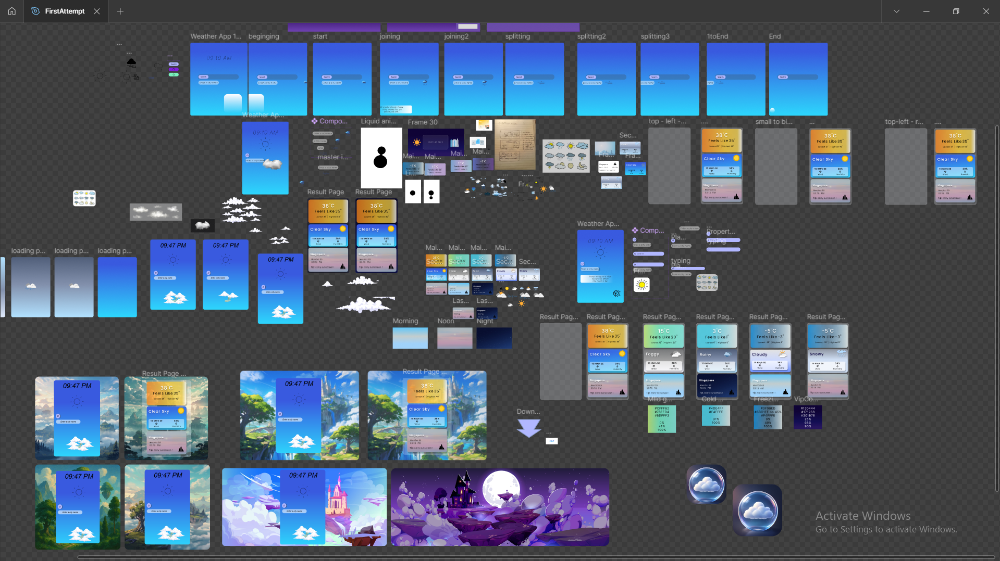
  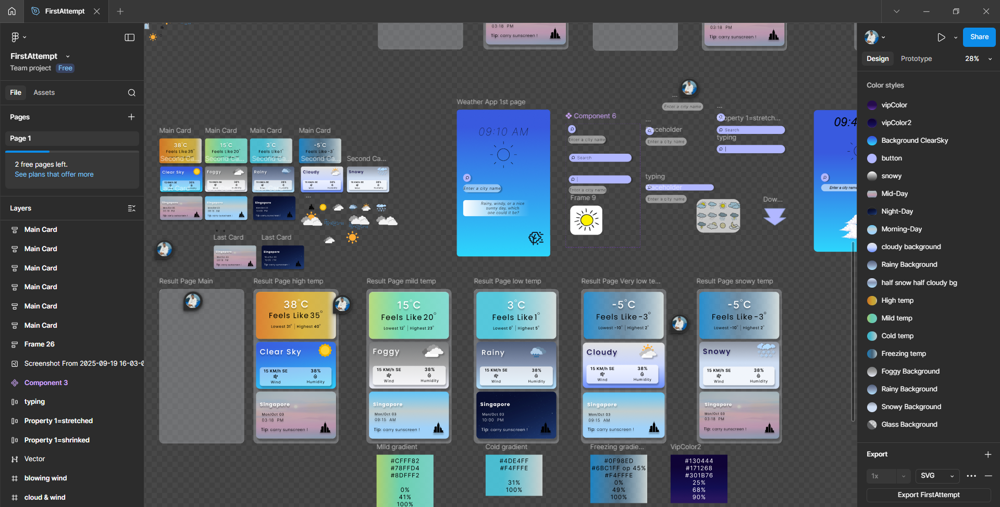

  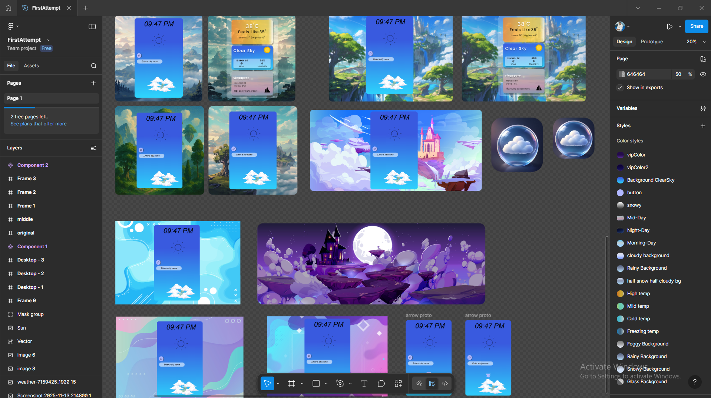

  

<h2 align="center">🌳 The 3D Era Begins</h2>

I discovered Spline and started modeling:

Perfume bottle

Robot

Realistic apple tree

Leaf with custom materials

  

  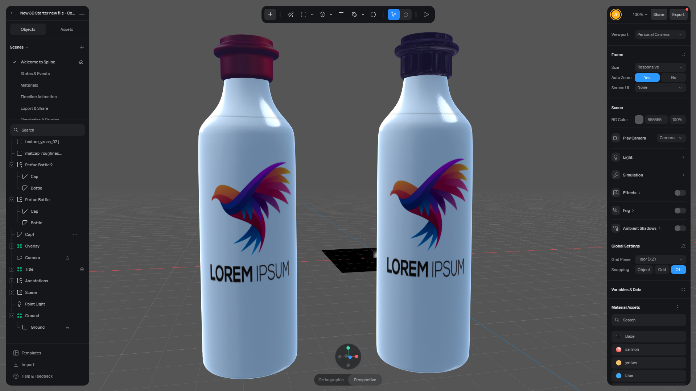
  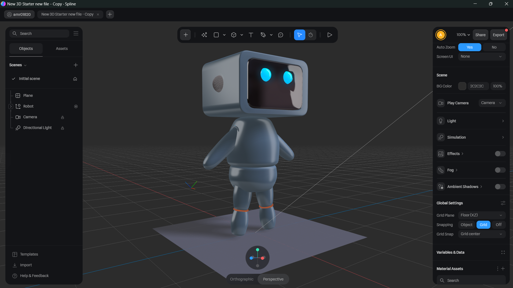

  
  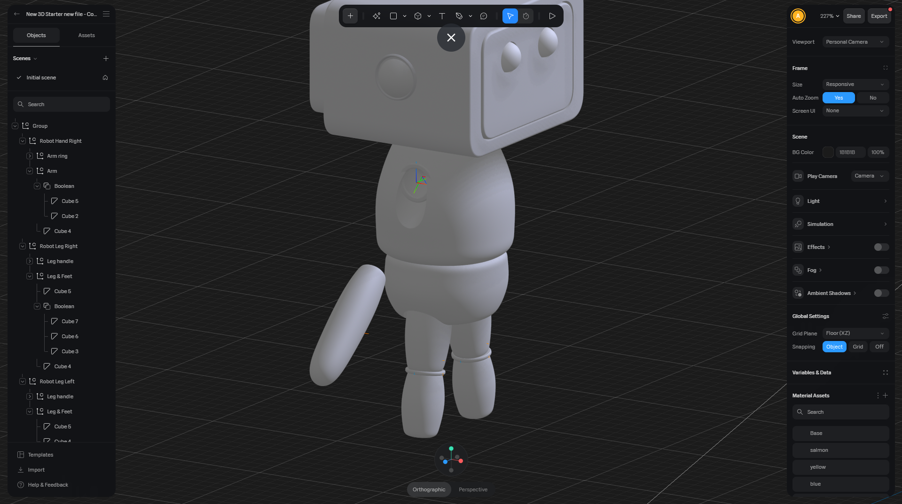

  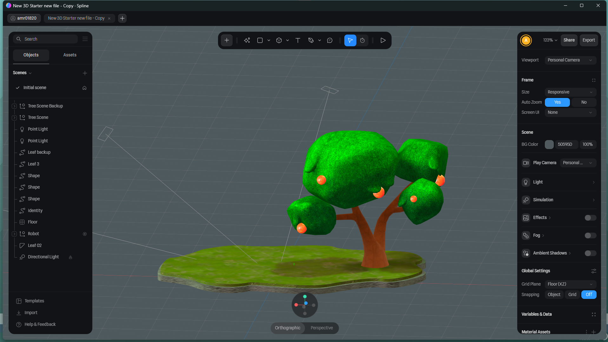
  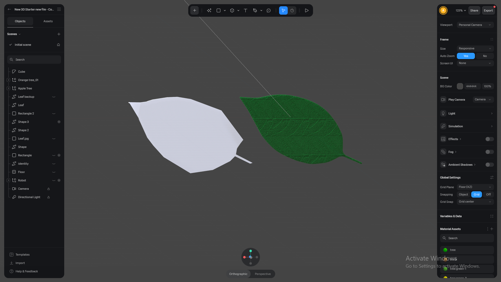

  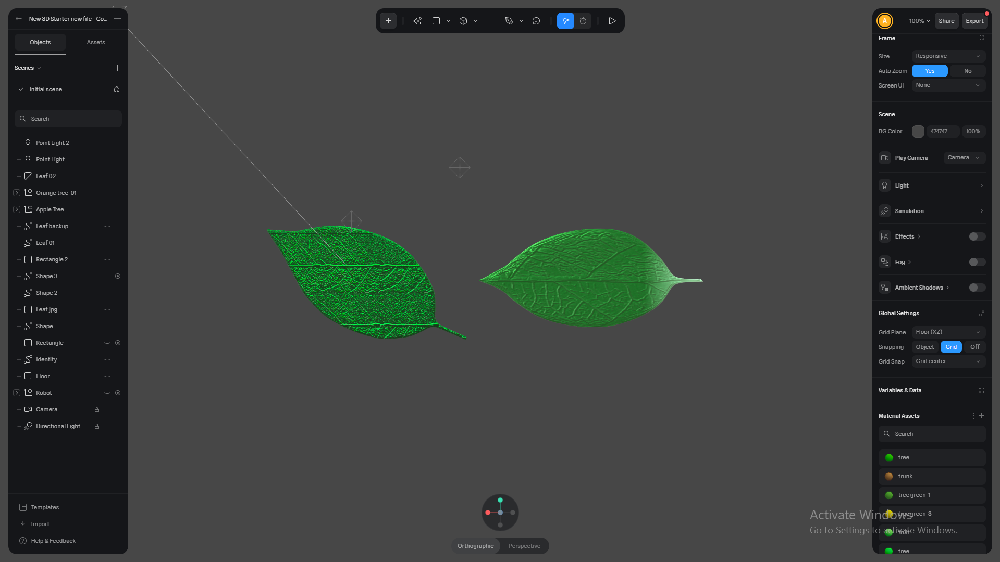

  

 

_Importing them into React became a boss fight:_
_the GLTF broke, Materials failed, Textures refused to load..._

 

  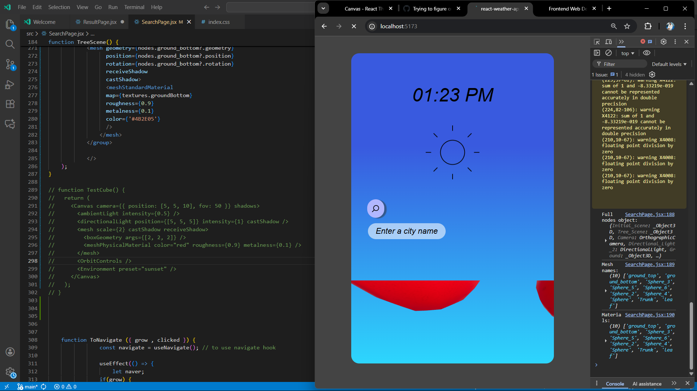
  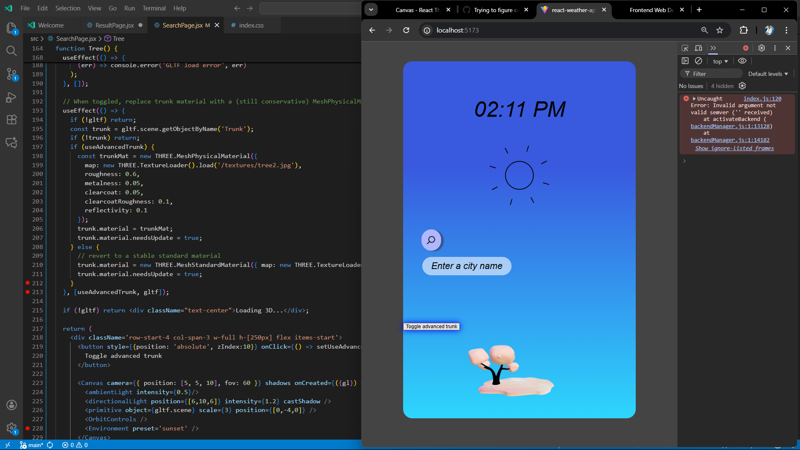

  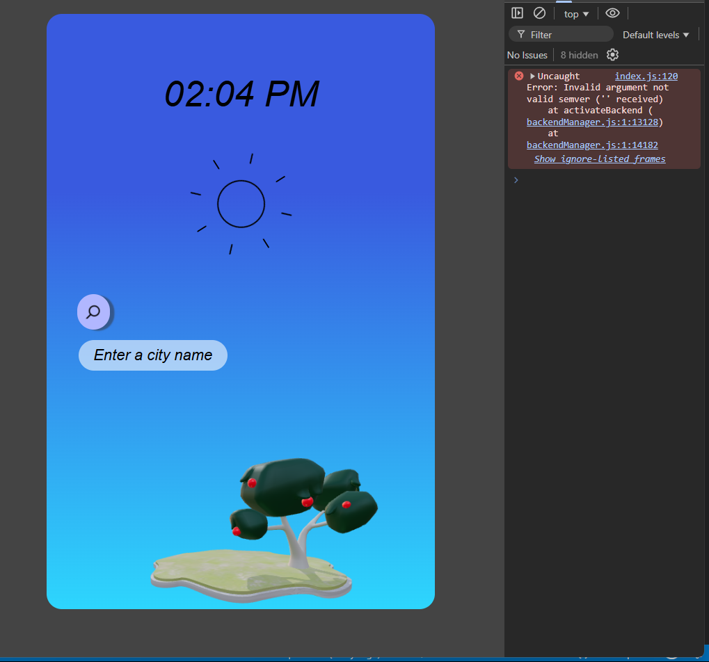

 
 

 

_It felt endless — but solving this taught me how to think like an engineer._

<h2 align="center">🎬 Animation, Storytelling & System Architecture</h2>

Once the 3D scene stabilized, the magic began:

GSAP animations

Zustand global state

Cinematic intro sequence

Cloud transitions

Camera zoom

Apple fall physics

Music syncing

One tap triggers four synchronized events — something I’m truly proud of.

<h2 align="center">🌤️ The App</h2>

<h3 align="center">1. Search Page</h3>

Live clock

Expanding search bar

Animated 3D fantasy landscape

Cinematic camera reveal

Soft atmospheric music

  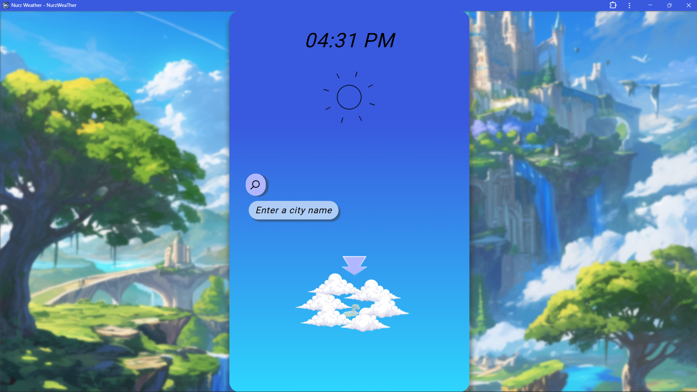

  

<h3 align="center">2. Results Page</h3>

Built entirely on real API data:

Temperature card (dynamic styles)

Weather condition visuals

Morning/afternoon/night modes

Adaptive layout + typography

Smooth transitions

 

  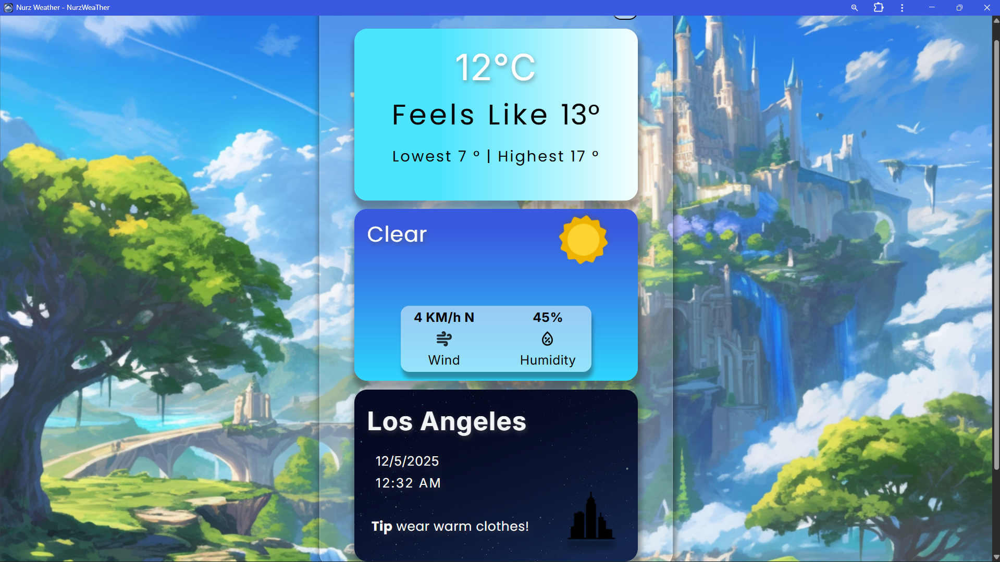

  

<h2 align="center">🧰 Tech Stack</h2>

<h3 align="center">🎨 Design & 3D</h3>

Figma

Spline 3D

<h3 align="center">🖥️ Frontend</h3>

React.js

Vite

React Router

TailwindCSS

HTML

CSS

JavaScript

<h3 align="center">🤖 3D & Animation</h3>

Three.js

React Three Fiber

GSAP

<h3 align="center">🎧 Audio</h3>

Howler.js

<h3 align="center">🔧 Other</h3>

Zustand

WeatherAPI

Git

ESLint

<h2 align="center">🌱 Lessons, Identity & Final Words</h2>

**This project helped me discover who I am:**

_A creative front-end developer blending design, storytelling, and engineering._

**It showed me what I’m capable of:**

**Taking a simple thought, And turning it into a polished, immersive, living experience**

_And it reminded me — and hopefully reminds you — that even during difficult times,  _
_creation can be a source of meaning —_
_and from collapse, something beautiful can grow._

<h2 align="center">

**🚀 Live Demo**

</h2>

**👉 https://nurzweather.vercel.app/**

<h3 align="center">

**🖥️ Demo (Desktop)**

</h3>

    <a href="https://github.com/user-attachments/assets/22f227ac-1459-4a33-94b8-09ac3c74d7af">▶️ Watch Desktop Demo</a>

<h3 align="center">

**📱 Demo (Mobile)**

</h3>

    <a href="https://github.com/user-attachments/assets/f352318d-6360-41b2-9c85-53e051693006">▶️ Watch Mobile Demo</a>

