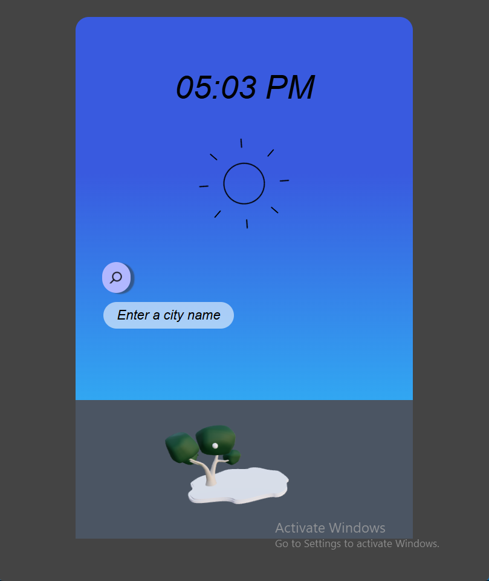
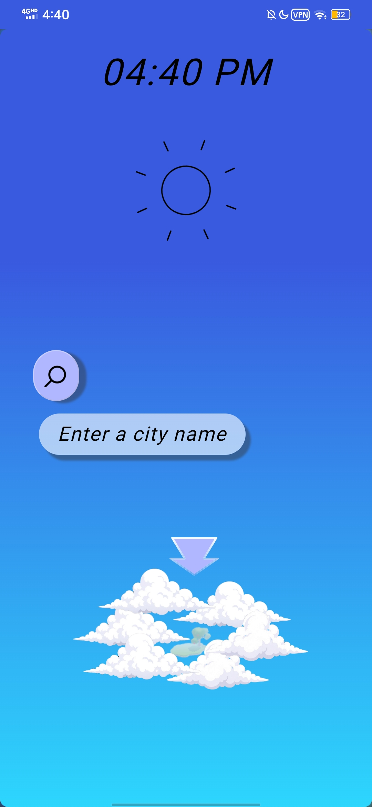
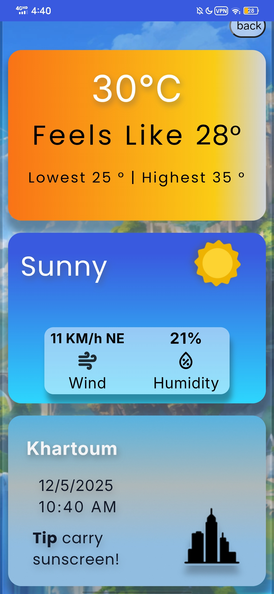

🌤️ NurzWeather — A Weather App Born From Chaos, Built With Purpose

“This project came to life at a time when everything else was collapsing…”

NurzWeather began as a small idea — a distraction during a difficult moment — but it grew into a transformative journey of learning, resilience, and self-discovery.

What started as a simple weather app became a cinematic, animated, immersive experience blending:

Design

Storytelling

3D art

Engineering

Emotion

⭐️ Features
🌐 Installable Progressive Web App (PWA)

NurzWeather is a fully installable PWA:

✔️ Add to home screen on mobile & desktop

✔️ Works offline after first load

✔️ Custom icons, manifest & splash screens

✔️ Service worker caching

✔️ Fast & lightweight

✔️ Native app-like experience

.png)
.jpg)

🎨 Immersive Fantasy Weather UI

Animated 3D landscape

Cinematic camera movement

Cloud animations

Falling apple physics

Soft atmospheric music

A UI that feels alive, not static

📊 Dynamic Weather System

Powered by real API data:

Temperature card with adaptive gradients

Dynamic typography & layout

Weather condition visuals

Morning / afternoon / night modes

Fully responsive and optimized

⚡️ High Performance

Code splitting

Lazy loading

Compressed assets

Optimized GLTF pipeline

Clean, maintainable architecture

🎯 Mission

I’ve always been fascinated by the immersive interfaces found in games and animated worlds — experiences that feel alive.

So I set out to create:

A weather app that doesn’t just show information —
but tells a story.

I wanted NurzWeather to solve a real problem and evoke emotion.
Something magical enough that a user might forget they're looking at a weather report.

✨ How It Started

For years I explored different fields:

C++

Python

Blender

Digital art

Design

But I couldn’t decide where I fit, is it Engineering? Design? Art?

Then one idea clicked:

Why not blend everything together?

I began with paper sketches → moved to Figma → then built it in React + Tailwind.

🌳 The 3D Era Begins

I discovered Spline and started modeling:

Perfume bottle

Robot

Realistic apple tree

Leaf with custom materials

Importing them into React became a boss fight:

the GLTF broke, Materials failed, Textures refused to load...

It felt endless — but solving this taught me how to think like an engineer.

🎬 Animation, Storytelling & System Architecture

Once the 3D scene stabilized, the magic began:

GSAP animations

Zustand global state

Cinematic intro sequence

Cloud transitions

Camera zoom

Apple fall physics

Music syncing

One tap triggers four synchronized events — something I’m truly proud of.

🌤️ The App
1. Search Page

Live clock

Expanding search bar

Animated 3D fantasy landscape

Cinematic camera reveal

Soft atmospheric music

2. Results Page

Built entirely on real API data:

Temperature card (dynamic styles)

Weather condition visuals

Morning/afternoon/night modes

Adaptive layout + typography

Smooth transitions

🖥️ Demo (Desktop)
<video width="600" controls> <source src="src/assets/Portiflio/DesktopLiveDemo.mp4" type="video/mp4" /> </video>
📱 Demo (Mobile)
<video width="300" controls> <source src="src/assets/Portiflio/MobileLiveDemo.mp4" type="video/mp4" /> </video>

🧰 Tech Stack

🎨 Design & 3D

Figma

Spline 3D

🖥️ Frontend

React.js

Vite

React Router

TailwindCSS

HTML 

CSS

JavaScript

🤖 3D & Animation

Three.js

React Three Fiber

GSAP

🎧 Audio

Howler.js

🔧 Other

Zustand

WeatherAPI

Git

ESLint

🌱 Lessons, Identity & Final Words

This project helped me discover who I am:

**A creative front-end developer blending design, storytelling, and engineering.

It showed me what I’m capable of:

Taking a simple thought, And turning it into a polished, immersive, living experience

_And it reminded me — and hopefully reminds you — that even during difficult times, creation can be a source of meaning —
and from collapse, something beautiful can grow._

🚀 Live Demo

👉 https://nurzweather.vercel.app/